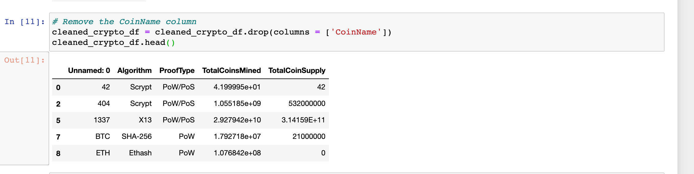
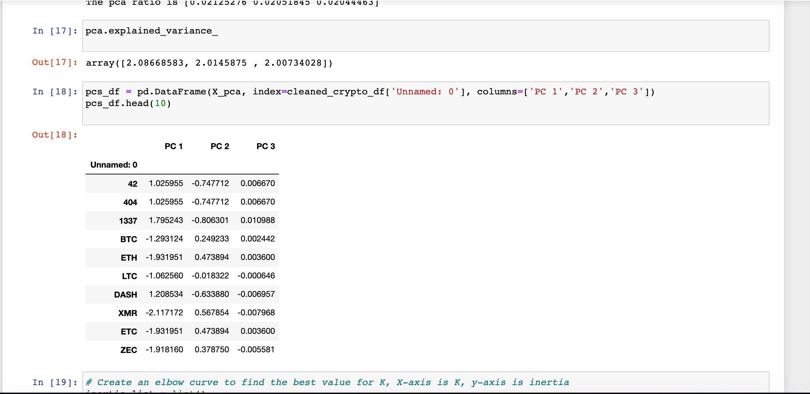
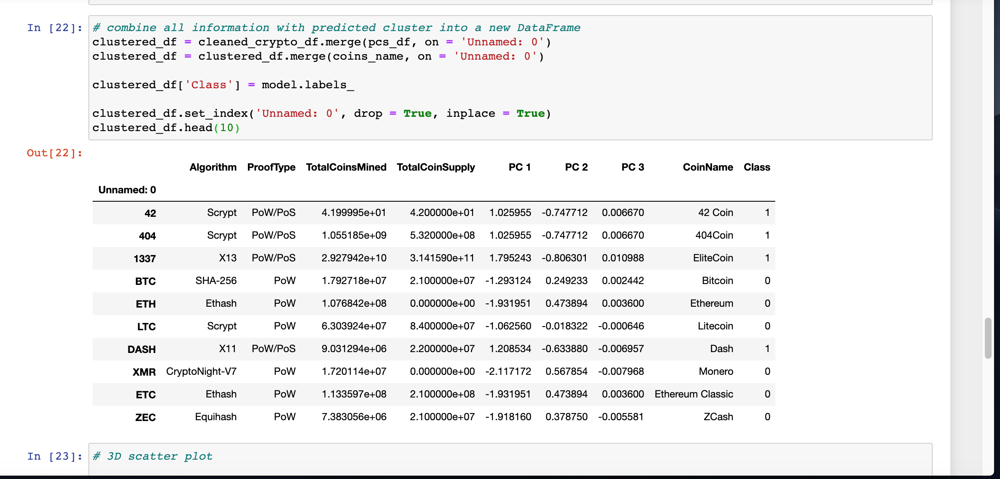
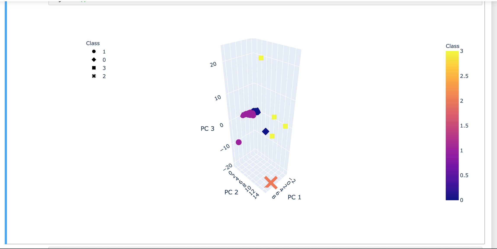
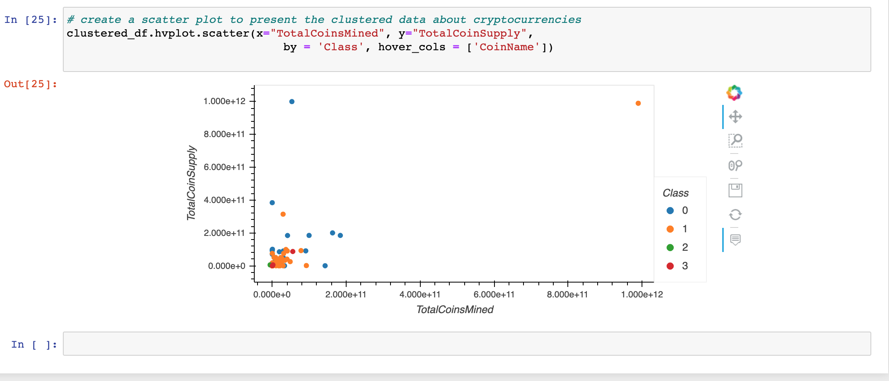

# Cryptocurrencies

  Present a report of what cryptocurrencies are on the trading market and how cryptocurrencies could be grouped toward creating a classification for developing a new investment product. Use unsupervised ML clustering algorithm to help determine cryptocurrencies groups.

# Overview
- Deliverable 1: Preprocessing the Data for PCA
- Deliverable 2: Reducing Data Dimensions Using PCA
- Deliverable 3: Clustering Cryptocurrencies Using K-means
- Deliverable 4: Visualizing Cryptocurrencies Results

# Results
- Deliverable 1:

- Deliverable 2:

- Deliverable 3:

- Deliverable 4:

- Deliverable 5:

# Summary
Using Principal Component Analysis (PCA) algorithm along with k means algorithm we are able to visualize data and determine the most tradable cryptocurrencies.We were able to find 532 tradable cryptocurrencies which could be a a good potential addition to the investment portfolio. Along with the help of the unsupervised machine learning algorithms we were able to conclude our findings.
## Data Rescources & Codes

-[CSV](Resources/CSV/crypto_data.csv)

-[JupyterNotebook](crypto_clustering.ipynb)

